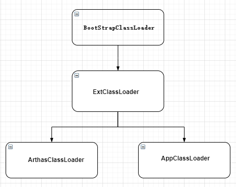
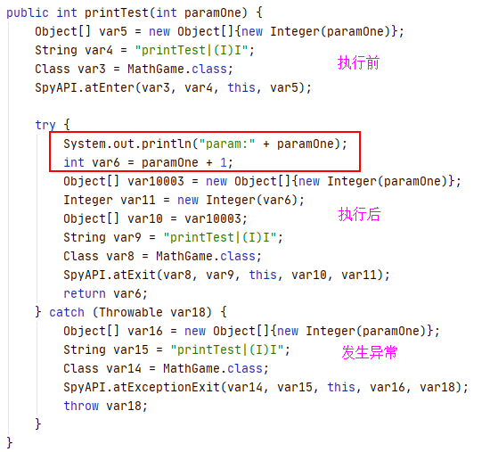

# Arthas原理：如何做到与应用代码隔离？

## 系列介绍目录：

[Java线上解决方案系列目录](//yeas.fun/archives/solution-contents)

## 为什么要代码隔离？

在上一篇文章：[Arthas原理：理解ClassLoader](//yeas.fun/archives/arthas-classloader)，我们讲了JDK的ClassLoader的原理，这是arthas实现代码隔离的理论基础。

代码隔离，也就是arthas所保证的：对业务代码无侵入，目标应用无需重启也无需感知arthas的存在。

那首先我们来讲下：arthas为什么要进行代码隔离？

我们都知道arthas是一个开源框架，它是在应用正在运行的时候，打通应用与arthas的连接通路。这就对arthas提出一个需求：arthas不能影响应用运行的代码，不能因为arthas的连接而导致业务逻辑的运行不正常。
同样的，应用里面的代码也不能影响arthas的正常工作。即：arthas的代码要和应用代码进行隔离，从机制上保证双方的互不干扰。

## Arthas是怎么连到我们的应用的？
其实JDK的也留了一个类似后门的方式：Agent，在这篇 [JAVA热更新1：Agent方式热更](//yeas.fun/archives/hotswap-agent) 文章中，也是利用了agent来实现的。agent网上资料特别多，大家自行了解。

简单点说：<font color=red>Agent就是可以在不停应用的情况下，把一个外部jar包代码动态加载到目标JVM中，再配合Instrumentation类，可以对目标应用做任何事，注意是任何事，包括动态修改JVM中运行的字节码，
从而实现对目标应用的逻辑修改</font>

即：<font color=red>**arthas的代码最终被加载进目标JVM**</font>，两者代码同时运行，且通过特殊方式可互相调用。那2份代码如何做到互不影响的？

## 怎么进行代码隔离？（核心思路）

Arthas代码隔离的思路，和阿里的另一个框架 [jvm-sandbox](https://github.com/alibaba/jvm-sandbox) 实现原理是一样的，很多源码都差不多，有兴趣的同学也可以研究研究。

通过上一篇文章 [Arthas原理：理解ClassLoader](//yeas.fun/archives/arthas-classloader) ，我们应该知道如何进行代码隔离了，就是使用不同的ClassLoader去加载类；
同时因为arthas需要执行jvm等命令，所以它需要调用到目标应用的Runtime的运行数据，而这些类都是JDK的底层类，一般是由ExtClassLoader或者BootstrapClassLoader去加载的。

```java
// Arthas源码：jvm命令中需要调用目标应用的JMX的相关代码
public class JvmCommand {
    private final RuntimeMXBean runtimeMXBean = ManagementFactory.getRuntimeMXBean();
    private final ClassLoadingMXBean classLoadingMXBean = ManagementFactory.getClassLoadingMXBean();
    private final CompilationMXBean compilationMXBean = ManagementFactory.getCompilationMXBean();
    private final Collection<GarbageCollectorMXBean> garbageCollectorMXBeans = ManagementFactory.getGarbageCollectorMXBeans();
    private final Collection<MemoryManagerMXBean> memoryManagerMXBeans = ManagementFactory.getMemoryManagerMXBeans();
    private final MemoryMXBean memoryMXBean = ManagementFactory.getMemoryMXBean();
    //    private final Collection<MemoryPoolMXBean> memoryPoolMXBeans = ManagementFactory.getMemoryPoolMXBeans();
    private final OperatingSystemMXBean operatingSystemMXBean = ManagementFactory.getOperatingSystemMXBean();
    private final ThreadMXBean threadMXBean = ManagementFactory.getThreadMXBean();
}
```

基于上一篇我们讲的ClassLoader的原理，那我们脑中应该有这个一张Arthas的ClassLoader图：



想要Arthas代码与应用的代码可同时获取到JMX等系统级的API，同时两者之间的代码是完全隔离的，
ArthasClassLoader与AppClassLoader就必须共用同一个parent：ExtClassLoader，且两者要互相分属不同的ClassLoader。

对应源码如下，SystemClassLoader一般就是启动服务的AppClassLoader，它的parent就是ExtClassLoader
```java
// Arthas源码：
public class ArthasClassloader extends URLClassLoader {
    public ArthasClassloader(URL[] urls) {
        super(urls, ClassLoader.getSystemClassLoader().getParent());
    }
}
```

## 隔离之后双方是如何工作的？

上面的架构方式保证了Arthas和目标JVM之间共享了JMX等底层API，也就是Arthas可以调用JDK的一些API获取相应的运行数据，比如说dashboard、thread、mbean等一些命令。
但还有一些命令是属于增强型的，arthas会对目标应用的代码注入一些代码，当目标应用的代码运行时，就会调用到arthas的监控，从而实现对目标应用的代码执行的监控，比如watch、tt、monitor等。

那么问题来了，我们刚刚还说arthas还是与目标应用代码隔离的，按道理来说目标应用是无法直接调用到arthas的代码的，怎么反过来目标应用执行时还能触发Arthas的监控代码呢？

应用代码想要直接调用Arthas确实是无法实现的，所以Arthas采用了一种巧妙的方案，它在目标应用和Arthas之间架起了一座桥梁，这座桥梁就是SpyAPI，Arthas源码里arthas-spy就是一个独立的模块，里面总共也就几个类。
既然是桥梁，SpyAPI就要被双方代码都能调用，也就是SpyAPI得要被双方共同的ClassLoader去加载，具体看如下源码：

```java
public class ArthasBootstrap{
    // Arthas源码：初始化spy
    private static void initSpy(Instrumentation instrumentation) throws Throwable {
        // 部分代码省略
        if (spyClass == null) {
            CodeSource codeSource = ArthasBootstrap.class.getProtectionDomain().getCodeSource();
            if (codeSource != null) {
                // 获取到spy的jar的位置
                File arthasCoreJarFile = new File(codeSource.getLocation().toURI().getSchemeSpecificPart());
                File spyJarFile = new File(arthasCoreJarFile.getParentFile(), ARTHAS_SPY_JAR);
                // 把spyJar添加到目标应用的BootstrapClassLoader的搜索路径中
                instrumentation.appendToBootstrapClassLoaderSearch(new JarFile(spyJarFile));
            } else {
                throw new IllegalStateException("can not find " + ARTHAS_SPY_JAR);
            }
        }
    }
}
```

从源码中可以看出：在Arthas启动时，<font color=red>Arthas会把spyJar添加到目标应用的BootstrapClassLoader的搜索路径中</font>，这样不管是Arthas还是目标应用，他们加载的都是同一个SpyAPI。

然后，在执行watch命令时，Arthas会对目标源码进行修改，假设源代码如下：

```java
public class Test{
    public int printTest(int paramOne) {
        System.out.print("param:" + paramOne);
        return paramOne;
    }
}
```

增强后，实际我们的应用代码就被动态改变为下面的代码：



这样，原应用代码在执行printTest方法时，就通过SpyAPI调用到Arthas的监控代码，从而实现Arthas的监控的实现。

## 总结
- Arthas如何进行代码隔离：Arthas与目标应用使用不同的ClassLoader进行加载各自的代码，但双方有共用parent：ExtClassLoader
- Arthas如何调用目标应用的JMX等底层代码：通过ExtClassLoader
- 目标应用如何调用Arthas的监控代码：通过SpyAPI和代码增强

## 扩展：代码隔离还有其他应用吗？

代码隔离其实是有很大的实用价值，一个最实用的功能就是实现代码的插件式增减功能，比如说eclipse和IDEA的插件。

不知道大家在日常使用工具的过程中，有没有思考过这样一个问题：IDEA的插件里面代码都是独自实现的，有的可能依赖于commons-lang的版本是3.1，而其他插件依赖的commons-lang的版本可能是3.2，
插件都是在同一个IDEA里面运行的，不同的jar包版本不会产生冲突吗？如果你看懂了上面的代码隔离，那么这个问题应该不难回答了。

我们也可以自己实现ClassLoader来动态加载自己的代码，这样可动态加载或卸载不同的模块，也就是可以自己实现插件机制了。

## 如何调试Arthas命令源码？

这个问题在我刚接触arthas的时候折腾了好久。不知道原理就不知道如何去进行调试，后来看了源码才知道，其实Arthas命令都是运行在目标应用上的。

所以想要调试Arthas的命令，就需要在目标应用上：
- 方式1：添加arthas依赖包，断点加在依赖包里源码上
- 方式2：把Arthas项目和目标应用放在一个项目中作为不同的模块，断点加在源码上

两者其实目的都一样，都是为了能在Arthas上加断点，这样目标应用执行到命令，IDEA就可以触发断点了。

另外还有一种方式也可以调试：就是在目标应用上增加远程调试，不会远程调试的可以百度

## 最后

上述一些流程，可能说的比较抽象，并没有展示多少源码，更多的是解释了Arthas的核心思路，如果有任何疑问的，都可以在文末给我留言，我会尽快给大家回复。

### --- END ----