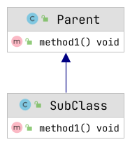

# JAVA热更新2：动态加载子类热更

## 系列介绍目录：

[Java线上解决方案系列目录](//yeas.fun/archives/solution-contents)

## 正文

上一篇《[JAVA热更新1：Agent方式热更](//yeas.fun/archives/hotswap-agent)》我们讲解了JDK提供的Agent方式来实现代码不停服更新，
受限于JDK的Agent一些限制，这种方式无法实现以下功能：只能修改方法体，不能变更方法签名、不能增加和删除方法/类的成员属性。

对于Instrumentation和JVM的agent，网上有不少文章，大家可以自行参考，今天我们来了解下第二种热更方式：动态加载子类热更

## 核心思路

热更新，顾名思义就是要替换代码实现。根本需求就是我怎么把改好的class替换进JVM中并实现逻辑调用。

一种办法就是直接替换代码逻辑，上一篇JVM提供的agent方式就属于此方法。那如果我们想从代码层级上实现代码替换有什么方式呢？
设计模式中有一种模式：代理模式，它的原理是对原类生成一个代理类并注册到系统中，应用层使用的是代理类，从而在代理层可以增加许多逻辑，Spring框架就是典型的应用者。

我们这里可以参考代理的思路，采用子类的方式来进行代码实现的逻辑替换。



如上图，Parent类中有一个方法method1()，如果我们想改变里面逻辑，可以写一个Parent的子类SubClass，然后覆写方法method1()，
这样外部调用还是Parent，但实际调用的对象替换为SubClass，即可实现代码的替换。

## 几个细节点

目前我们有了大概的思路，具体实现还有以下几个细节需要考虑：

- 如何生成子类？
- 生成的类如何加载进入jvm？
- 代码中如何调用才能实现调用的替换？

### 如何生成子类？

我们期望的热更方式是把修改后的class上传到原路径下并覆盖，那应该如何动态生成子类呢？

关于动态生成类的开源框架有几种：asm、cglib、javaassit，各有利弊。
这里应用场景是热更新，所以对性能要求不高，但考虑到可读性和维护性，项目中尽量也不考虑直接操作字节码，
所以最终我们选择了javaassist框架，它是可以直接通过java代码来构建新类。

具体做法：

从原路径上读取修改后的class文件的二进制字节流，并通过javaassist框架构建新的class，对新class进行如下操作：
- 改名，新类名为：原名+$$$SUBCLASS
- 让新类继承原类
- 设置子类的构造函数为public，且调用父类的默认构造函数，方便后续反射构建对象
- 忽略父类里的final方法，因为final是无法继承的，覆写会导致语法报错

### 生成的类如何加载进入jvm？

class想要加载进入jvm，唯一途径就是通过ClassLoader，因此这里我们自实现RecompileClassLoader继承于ClassLoader，实现二进制字节加载class进入JVM

### 对象注册机制？

现在我们已经有了一个新子类，它继承于原类，且覆写了原类的方法，那业务层怎么才能不修改代码的情况下能自动实现SubClass替换Parent实现逻辑？

解决方案就是对象注册机制，简单理解就是对象的映射关系。 我们应用层用的都是从注册机制获取的，这样进行热更时，我们只要把当前注册的对象替换为新对象，因为新对象是原对象的子类，可覆写方法，从而实现逻辑的替换。

具体类图如下：


### 如何不停服新增功能？

通过上面流程，我们知道本方法原理就是：读取一个class文件，并动态加载进入jvm虚拟机，从而实现代码替换。

那基于上面的注册机制，那附带就有了一个新功能：动态新增注册类（也就是RegistryManager.registerNewOne()）。
比如新写一个注册类，调用注册系统接口可编译新类并注册进系统中，
尤其对于游戏服务，一般的逻辑都是走消息号映射逻辑的，天然适合注册机制，这样线上可动态新增消息号和对应的实现逻辑，从而达到不停服增加功能的目的。

## 优缺点对比

两者：都支持对特定逻辑进行热更

| 热更类型|优点|缺点|
| --- | --- | --- |
| Agent方式|对于JVM的类基本都可以热更 |只能修改方法体，不能变更方法签名、不能增加和删除方法/类的成员属性。<br />某些特定情况下，有极低机率导致JVM崩溃（可能是JVM的BUG，暂无法复现）|
| 动态编译新类| 因为采用的是新生成，所以支持修改签名，新增方法甚至新增实现等|需要把热更的逻辑按照注册机制编写，否则无法热更|

## 总结

最终我们形成了这样的流程：

- 本地修改bug，并把修改后的class上传服务器
- 热更时，读取修改后的class文件，按照一定流程对原class进行重新构建，生成子类
- 将子类注册到注册系统，从而实现子类的替换
- 业务层基于注册系统获取的对象是原来子类，则实际调用的API是子类的实现
- 基于此，还可以动态注册新的逻辑到系统中，实现不停服新增功能

## 示例代码github：

[https://github.com/cm4j/cm4j-all](https://github.com/cm4j/cm4j-all)

## 运行测试

运行 RegistryManagerTest.hotswapTest()，结果如下：

```text

[main] ERROR com.cm4j.registry.RegistryManagerTest - 热更新前的类：class com.cm4j.demo.util.DemoUtil
[main] ERROR com.cm4j.hotswap.recompile.RecompileHotSwap - class dumpd: D:\Projects\others\cm4j-projects\cm4j-all\cm4j-hotswap\recompile-output\DemoUtil$$$SUBCLASS-20211111161652.class
[main] ERROR com.cm4j.registry.AbstractRegistry - [hotswap] success:class com.cm4j.demo.util.DemoUtil -> com.cm4j.demo.util.DemoUtil$$$SUBCLASS@148080bb
[main] ERROR com.cm4j.registry.RegistryManagerTest - 热更新后的类(已替换为原类的子类)：class com.cm4j.demo.util.DemoUtil$$$SUBCLASS
```

由此可见，经过热更之后，业务调用类已由DemoUtil替换为DemoUtil$$$SUBCLASS，且两者是父子关系。可有效解决外部基于对象类型判断的问题

## 最后
尽管热更新能解决一部分问题，但已经发生的错误数据是无法通过热更新修复的，所以我们就期望直接在线上不停服执行代码。这就是 [JAVA不停服执行代码（动态代码执行）](//yeas.fun/archives/java-eval)

### -- END-- 